## Nginx Rate Limit — PHP Login Demo:

A minimal PHP login API + HTML login page, protected by Nginx `limit_req`.


### Simple Architecture:




### Project structure:

```bash
tree

.
├── api
│   ├── login.php     ← POST /api/login.php  (rate limited: 5r/min)
│   └── status.php    ← GET  /api/status.php (rate limited: 30r/min)
├── public
│   └── index.html    ← Login page (HTML/CSS/JS)
```


### Demo credentials:

| Username  | Password    |
|-----------|-------------|
| admin     | password123 |
| testuser  | test1234    |


---
---


## Setup:

### 1. Install Nginx + PHP-FPM:

```bash
# Ubuntu/Debian:


# CentOS/Rocky:
yum install epel-release -y
yum install https://rpms.remirepo.net/enterprise/remi-release-7.rpm

yum-config-manager --enable remi-php74

yum install -y nginx
yum install -y php php-cli php-common php-mysqlnd php-xml php-mbstring php-gd php-opcache
yum install -y php-fpm
```


### 2. Copy project files:

```bash
cp -r public/ /usr/share/nginx/html/public
cp -r api/    /usr/share/nginx/html/api

chown -R nginx:nginx /usr/share/nginx/html       # For CentOS
```


### 3. Configure Nginx and HTTP rate limiting: 

_Key parameters explained:_
- `limit_req_zone`          : defines shared memory + rate
- `limit_req`               : applies the limit
- `$binary_remote_addr`     : client IP
- `zone=api_limit:10m`      : shared memory zone (10MB)
- `10m`                     : 10MB shared memory zone
- `rate=10r/s` or `rate=10r/m` : Max 10 requests/second per IP (also: `r/m` for per minute)
- `burst=20`                : Allow up to 20 queued excess requests
- `nodelay`                 : Process burst immediately instead of spacing them out 
- `limit_req_status 429`    : Set the HTTP error code for rejected requests; Default is 503, you can change it 


_Rate limit config (quick reference):_

| Location          | Zone         | Rate   | Burst |
|-------------------|--------------|--------|-------|
| /api/login.php    | login_limit  | 10/min | 5     |
| /api/*            | api_limit    | 30/min | 10    |
| / (static)        | api_limit    | 30/min | 10    |


_Remove default site if needed:_
```bash
rm -f /etc/nginx/sites-enabled/default
```


_Open Nginx config file `/etc/nginx/nginx.conf`:_
```conf 

events {
    worker_connections 1024;
}

# Define the zone in the http block
http {

    # Zone name: "login_limit" and "api_limit", keyed by client IP ($binary_remote_addr)
    # 10MB shared memory can track ~160,000 IPs
    # Rate: 10 requests per minute per IP
    limit_req_zone $binary_remote_addr zone=login_limit:10m rate=10r/m;
    limit_req_zone $binary_remote_addr zone=api_limit:10m rate=30r/m;

    ## Connection limit (Anti-DDoS):
    #limit_conn_zone $binary_remote_addr zone=conn_limit:10m;

    server {
        listen 80;
        server_name yourdomain.com;

        root  /usr/share/nginx/html/public;
        index index.htm index.html;

        # Catch-all PHP block (fallback for any other .php files)
        location ~ \.php$ {
          fastcgi_split_path_info ^(.+\.php)(/.+)$;
          fastcgi_pass  127.0.0.1:9000;
          fastcgi_index index.php;
          include       fastcgi.conf;
        }

        # Static files (For general traffic)
        location / {
          # Apply the zone, allow burst of 10, no delay on burst:
          limit_req zone=api_limit burst=10 nodelay;

          # Return 429 (standard) instead of default 503:
          limit_req_status 429;

          ## Max 10 simultaneous connections per IP:
          #limit_conn conn_limit 10;

          try_files $uri $uri/ =404;
        }

        # Login endpoint — tight rate limit (10 req/min, burst 5)
        location = /api/login.php {
          limit_req zone=login_limit burst=5 nodelay;
          limit_req_status 429;
          error_page 429 = @rate_limited;

          #root /usr/share/nginx/html/api/login.php;

          fastcgi_split_path_info ^(.+\.php)(/.+)$;
          fastcgi_pass  127.0.0.1:9000;
          fastcgi_index index.php;
          include       fastcgi.conf;
          fastcgi_param SCRIPT_FILENAME /usr/share/nginx/html/api/login.php;
        }

        # Other /api/*.php — relaxed rate limit (30 req/min, burst 10)
        location /api/ {
          limit_req zone=api_limit burst=10 nodelay;
          limit_req_status 429;
          error_page 429 = @rate_limited;

          #root /usr/share/nginx/html;

          fastcgi_split_path_info ^(.+\.php)(/.+)$;
          fastcgi_pass  127.0.0.1:9000;
          fastcgi_index index.php;
          include       fastcgi.conf;
          fastcgi_param SCRIPT_FILENAME /usr/share/nginx/html$fastcgi_script_name;
        }

        # JSON response for rate-limited requests
          location @rate_limited {
          default_type application/json;
          return 429 '{"success":false,"error":"RATE_LIMITED","message":"Too many requests. Retry after 60s.","retry_after":"60s"}';
        }

        # Security headers
        add_header X-Content-Type-Options nosniff;
        add_header X-Frame-Options        DENY;

        # Logging
        access_log /var/log/nginx/rate-demo-access.log;
        error_log  /var/log/nginx/rate-demo-error.log warn;

    }
}

```


```bash 

nginx -t
systemctl restart nginx
```


_Real-World Example (API Protection):_
```conf 

http {
    limit_req_zone $binary_remote_addr zone=api_limit:10m rate=10r/s;

    server {
        listen 80;
        server_name yourdomain.com;

        location /api/ {
            limit_req zone=api_limit burst=5 nodelay;
            limit_req_status 429;

            proxy_pass http://127.0.0.1:8080;
        }
    }
}

```


_Login page protection:_
```conf 

http {
    limit_req_zone $binary_remote_addr zone=login_limit:10m rate=2r/s;

    server {
        listen 80;
        server_name yourdomain.com;

        location /login {
            limit_req zone=login_limit burst=5 nodelay;

            proxy_pass http://127.0.0.1:8080;
        }
    }
}

```


### 4. Start PHP-FPM:

```bash
systemctl restart nginx
systemctl status php-fpm
```


### 5. Open in browser:

```
http://your_ip/
```


---
---


## Verify: 

### Test rate limiting with curl:

```bash
## Hit the login endpoint 20 times rapidly — should get 429 after burst

for i in $(seq 1 20); do
  curl -s -o /dev/null -w "Request $i: HTTP %{http_code}\n" \
    -X POST http://localhost/api/login.php \
    -H 'Content-Type: application/json' \
    -d '{"username":"admin","password":"password123"}'
done
```


### Watch rate limit hits live:

```bash

tail -f /var/log/nginx/rate-demo-error.log | grep limiting
```


Everything else in the doc looks correct — the architecture, curl test, parameter table, and real-world examples are all good to publish.


